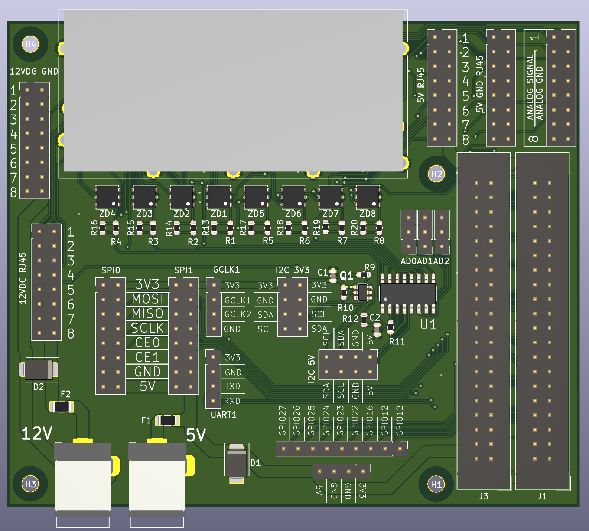

# FlameIT - 1-Wire Expander (OWEX) module documentation

[FlameIT - Immersion Cooling](https://flameit.io) 1-Wire Expander module.

![FlameIT - Immersion Cooling 1-Wire Expander Module [FIT OWEX]](owex.jpg "FlameIT - Immersion Cooling 1-Wire Expander Module [FIT OWEX]")

![FlameIT - Immersion Cooling 1-Wire Expander Module with RaspberyPi connected [FIT OWEX + RPi]](owex-rpi.jpg "FlameIT - Immersion Cooling 1-Wire Expander Module with RaspberyPi connected [FIT OWEX + RPi")

## Features

* Allows Easy Interface Between an I2C Micro Port and a 1-Wire Slave
* Integrates with OWFS (One Wire File System) without any problems. Sesnors are then visible on system as files.
* I2C Host Interface Supports 100kHz and 400kHz I2C Communication Speeds
* 8 Channels of Independently Operated 1-Wire I/O.
* Each 1-Wire Channel is **ESD protected**: **DS9503**
* 1-Wire Master I/O with Selectable Active or Passive 1-Wire Pullup
* Provides Reset/Presence, 8-Bit, Single-Bit, and 3-Bit 1-Wire I/O Sequences
* Standard and Overdrive 1-Wire Communication Speeds 2
* Three Address Inputs for I2C Address Assignment [AD0, AD1, AD3 goldpins]
* Minimizes Line Noise, Reducing System EMI
* Slew-Controlled 1-Wire Edges
* Supports EEPROMs, Temp Sensors, or Other 1-Wire Slaves That Have Momentary High Source Current Modes
  * Strong 1-Wire Pullup Provided by an Internal Low-Impedance Signal Path
  * PCTLZ Output to Optionally Control an External MOSFET for Stronger Pullup Requirements
* Wide Operating Range: 2.9V to 5.5V, -40°C to +85°C
* RoHS Compliant

The **DS2482-800** is an I²C to 1-Wire® bridge device that interfaces directly to standard (100kHz max) or fast (400kHz max) I²C masters to perform bi-directional protocol conversion between the I²C master and any downstream 1-Wire slave devices. Relative to any attached 1-Wire slave device, the DS2482-800 is a 1-Wire master. Internal factory-trimmed timers relieve the system host processor from generating time-critical 1-Wire waveforms, supporting both standard and Overdrive 1-Wire communication speeds. To optimize 1-Wire waveform generation, the DS2482-800 performs slew-rate control on rising and falling 1-Wire edges and has a programmable feature to mask the fast presence pulse edge that some 1-Wire slave devices can generate. Programmable strong pullup features support 1-Wire power delivery to 1-Wire devices such as EEPROMs and sensors. The DS2482-800 combines these features with eight independent 1-Wire I/O channels. The I²C slave address assignment is controlled by three binary address inputs, resolving potential conflicts with other I²C slave devices in the system.

## RaspberryPi Installation

Everything is done by [install.sh](install.sh) file dirrectory in this repository.

### I2C && OWFS on RaspberryPi

OWFS is responsible for all I2C communication with our module. All 1-Wire sensors connected to module are than visible as files in filesystem.

* [https://owfs.org](https://owfs.org)

### Minimall steps to install OWFS

Here is how to read the current state of the I2C port:

```bash
sudo raspi-config nonint get_i2c
```

This command will return:

* 1 if the port is disabled
* 0 if the port is enabled

```bash
# Enable I2C on RaspberryPi
sudo raspi-config nonint do_i2c 0

# Install OWFS
sudo apt update && sudo apt upgrade
sudo apt install owfs

```

`owfs.conf`

```bash
# FlameT - 1-Wire Expander module on I2C (bus 1)
# i2cdetect -y 1
#      0  1  2  3  4  5  6  7  8  9  a  b  c  d  e  f
# 00:                         -- -- -- -- -- -- -- --
# 10: -- -- -- -- -- -- -- -- 18 -- -- -- -- -- -- --
# 20: -- -- -- -- -- -- -- -- -- -- -- -- -- -- -- --
# 30: -- -- -- -- -- -- -- -- -- -- -- -- -- -- -- --
# 40: -- -- -- -- -- -- -- -- -- -- -- -- -- -- -- --
# 50: -- -- -- -- -- -- -- -- -- -- -- -- -- -- -- --
# 60: -- -- -- -- -- -- -- -- -- -- -- -- -- -- -- --
# 70: -- -- -- -- -- -- -- --
server: device = /dev/i2c-1
```

## Pinout



* https://opencircuits.com/images/a/a3/A_Guide_to_the_1WRJ45_Standard.pdf

![FlameIT - Immersion Cooling 1-Wire Expander Module [FIT OWEX] - PINOUT description from schema](pinout-schema.png "FlameIT - Immersion Cooling 1-Wire Expander Module [FIT OWEX] - PINOUT description from schema")

![FlameIT - Immersion Cooling 1-Wire Expander Module [FIT OWEX] - PINOUT](pinout.png "FlameIT - Immersion Cooling 1-Wire Expander Module [FIT OWEX] - PINOUT")

## 3D model - STEP file

[GRABCAD.COM - FlameIT - Immersion Cooling - 1-Wire Expander Module STEP/3D model](https://grabcad.com/library/fit-owex-1-wire-expander-module-flameit-immersion-cooling-1)

## Author

* Paweł 'felixd' Wojciechowski - FlameIT - [Immersion Cooling](https://flameit.io)
